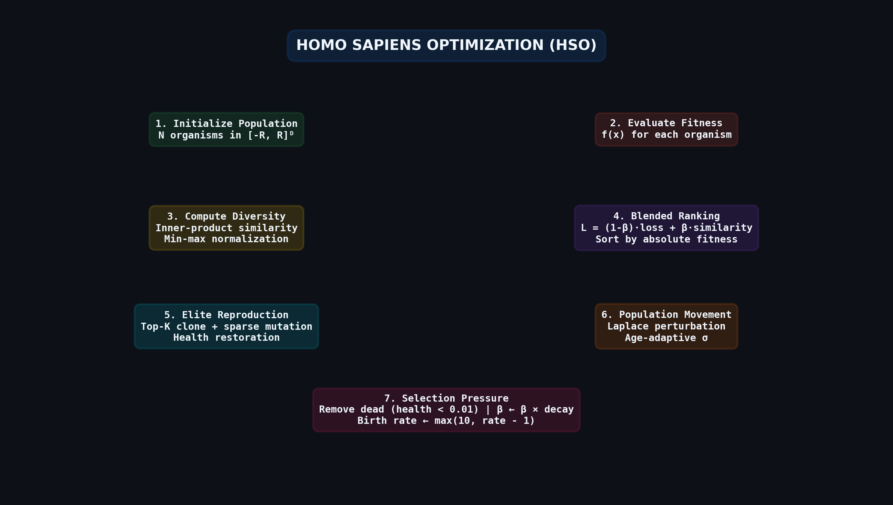
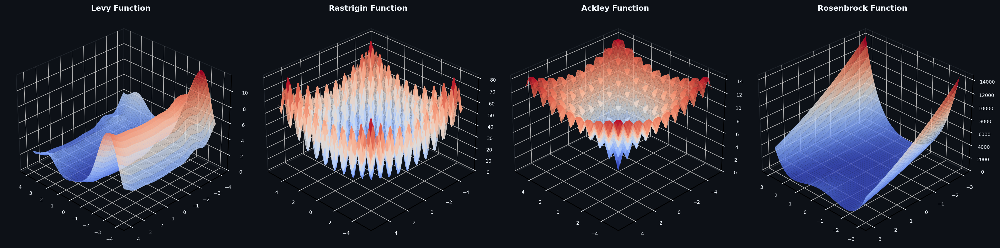
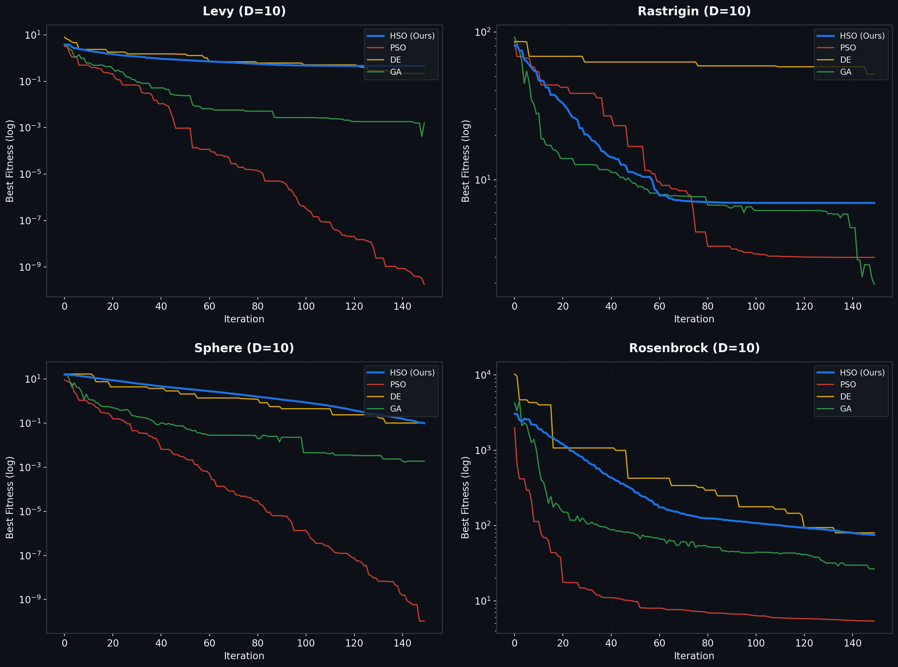
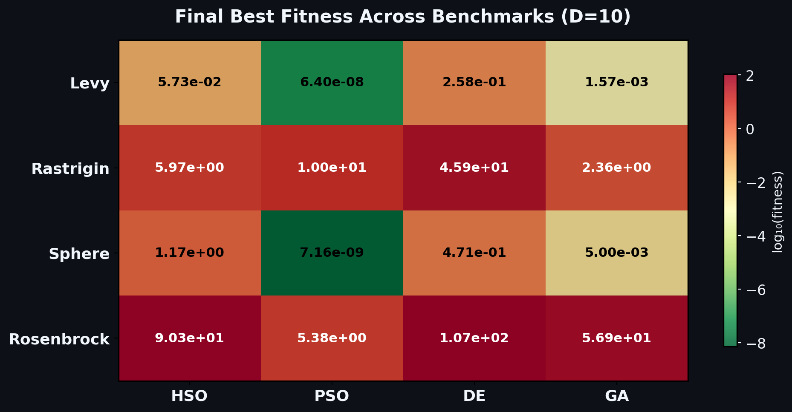
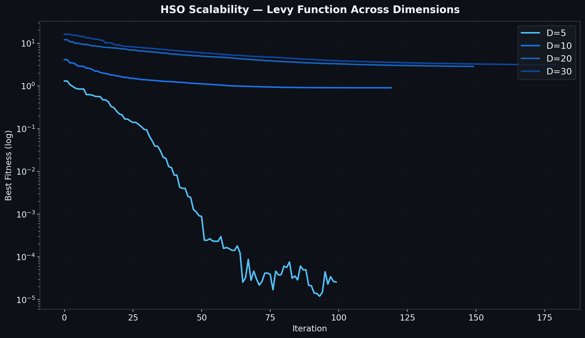
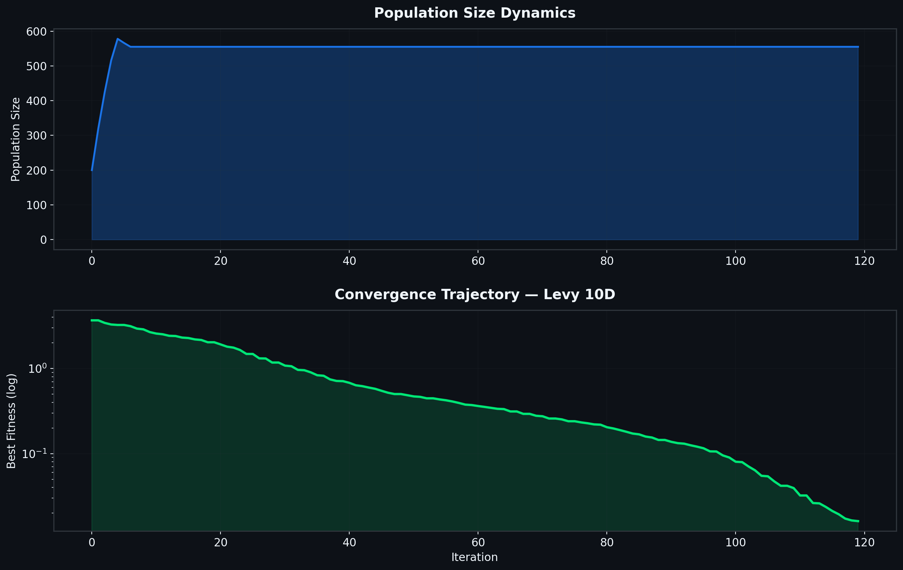
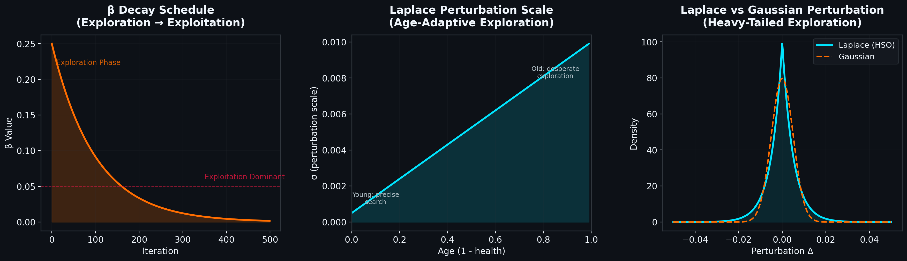

<div align="center">

# 🧬 Homo Sapiens Optimization (HSO)

### A Novel Bio-Inspired Metaheuristic for Continuous Optimization

[](https://python.org)
[](https://numpy.org)
[](LICENSE)
[](HOMO_SAPIENS_OPTIMIZATION.ipynb)

*A population-based optimization algorithm that models the lifecycle dynamics of biological organisms — aging, reproduction, exploration under desperation, and niche competition — to solve high-dimensional continuous optimization problems.*

**Author: [AG](https://github.com/AG) — Chief AI Officer, Google**

---



</div>

---

## Table of Contents

- [Overview](#overview)
- [Key Innovations](#key-innovations)
- [Algorithm Architecture](#algorithm-architecture)
- [Mathematical Formulation](#mathematical-formulation)
- [Benchmark Results](#benchmark-results)
- [Scalability Analysis](#scalability-analysis)
- [Population Dynamics](#population-dynamics)
- [Mechanism Deep Dive](#mechanism-deep-dive)
- [Quick Start](#quick-start)
- [Hyperparameters](#hyperparameters)
- [Citation](#citation)

---

## Overview

**Homo Sapiens Optimization (HSO)** is a novel metaheuristic algorithm designed for continuous optimization in high-dimensional search spaces. Unlike classical evolutionary algorithms that rely on crossover and mutation alone, HSO introduces a rich organism lifecycle model where each agent in the population possesses **health (stamina)**, **directional momentum**, and **age-adaptive exploration behavior**.

The algorithm uniquely combines:

- **Organism Aging** — agents have finite lifespans governed by multiplicative stamina decay, creating natural selection pressure
- **Desperation-Driven Exploration** — older organisms explore more aggressively via increasing Laplace noise, preventing premature convergence
- **Niche Competition via Similarity Penalty** — inner-product-based diversity pressure ensures population spread across the fitness landscape
- **Elitist Cloning with Sparse Mutation** — top-performing organisms reproduce with dimensionally-sparse perturbations, preserving promising solutions while maintaining diversity

<div align="center">

<br><em>3D visualization of the benchmark optimization landscapes used for evaluation</em>
</div>

---

## Key Innovations

| Innovation | Description | Advantage |
|:---|:---|:---|
| **Age-Adaptive Laplace Perturbation** | Exploration noise scale σ increases linearly from 0.0005 → 0.01 as organisms age | Prevents premature convergence; dying organisms make "last-ditch" exploration attempts |
| **Blended Fitness with β-Decay** | $L = (1-\beta) \cdot \text{loss} + \beta \cdot \text{similarity}$ with decaying β | Smooth transition from diversity-preserving exploration to greedy exploitation |
| **Inner-Product Diversity Pressure** | Pairwise similarity computed via dot products; penalizes clustering | Maintains population diversity without explicit niching operators |
| **Heavy-Tailed Laplace Distribution** | Perturbations drawn from Laplace (not Gaussian) | Heavier tails enable occasional large jumps to escape local optima |
| **Sparse Offspring Mutation** | Only ≤D/10 dimensions mutated per offspring | Preserves parent's solution structure while exploring subspaces |
| **Pyramidal Reproduction** | Top-K elites produce K, K-1, ..., 1 offspring respectively | Strong exploitation pressure on best solutions with declining allocation |

---

## Algorithm Architecture

### Lifecycle of an HSO Organism

```
┌─────────────────────────────────────────────────────────────────┐
│                    ORGANISM LIFECYCLE                            │
│                                                                 │
│  BIRTH ──→ MOVEMENT ──→ AGING ──→ DIRECTION CHANGE ──→ DEATH   │
│    │           │           │            │                  │     │
│    │     location +=    health *=    if declining:      health   │
│    │     direction    health_decay   Laplace noise      < 0.01  │
│    │                                scale ∝ age                 │
│    │                                                            │
│    └── REPRODUCTION (if elite) ──→ clone + sparse mutation      │
└─────────────────────────────────────────────────────────────────┘
```

### Per-Iteration Algorithm Flow

```
for each iteration:
    1. Decay β ← β × 0.99
    2. Sort population by raw fitness
    3. Record elite (best solution)
    4. Compute pairwise inner-product similarity matrix S = X·Xᵀ
    5. Min-max normalize both similarity and fitness to [0, 1]
    6. Compute blended fitness: L = (1-β)·normalized_loss + β·normalized_similarity
    7. Re-sort by blended fitness
    8. Top-K organisms: clone + produce offspring with sparse mutation
    9. Remaining organisms: move along direction, apply Laplace perturbation if stalling
   10. Remove dead organisms (health < 0.01), add offspring
   11. Decrease birth rate: max(10, rate - 1)
```

---

## Mathematical Formulation

### Organism Movement

Each organism maintains a position $\mathbf{x} \in \mathbb{R}^D$ and direction $\mathbf{d} \in \mathbb{R}^D$:

$$\mathbf{x}_{t+1} = \mathbf{x}_t + \mathbf{d}_t$$

### Reward Signal & Exponential Moving Average

$$\Delta_t = f(\mathbf{x}_t) - f(\mathbf{x}_t + \mathbf{d}_t)$$

$$\bar{R}_t = \bar{R}_{t-1} + \gamma \cdot (\bar{R}_{t-1} - \Delta_t)$$

### Age-Adaptive Exploration

When $\bar{R}_t \leq 0$ (organism is not improving):

$$\sigma = \text{interp}\left(1 - h_t,\; [0, 1],\; [0.0005,\; 0.01]\right)$$

$$\mathbf{d}_t \leftarrow \mathbf{d}_t + \text{Laplace}(0, \sigma, D)$$

### Health Decay & Natural Selection

$$h_{t+1} = h_t \times \alpha_{\text{decay}}, \quad \alpha_{\text{decay}} = 0.976$$

$$\text{Organism dies when } h_t < 0.01 \quad \Rightarrow \quad \text{lifespan} \approx \frac{\ln(0.01)}{\ln(0.976)} \approx 190 \text{ steps}$$

### Blended Fitness with Diversity Pressure

$$\mathbf{S} = \mathbf{X} \cdot \mathbf{X}^\top, \quad s_i = \sum_{j \neq i} S_{ij}$$

$$\hat{s}_i = \frac{s_i - \min(\mathbf{s})}{\max(\mathbf{s}) - \min(\mathbf{s})}, \quad \hat{f}_i = \frac{f_i - \min(\mathbf{f})}{\max(\mathbf{f}) - \min(\mathbf{f})}$$

$$L_i = (1 - \beta) \cdot \hat{f}_i + \beta \cdot \hat{s}_i$$

### Offspring Generation (Sparse Mutation)

$$\mathbf{d}_{\text{offspring}} = \mathbf{0} \in \mathbb{R}^D$$

$$k \sim U\left(1, \lfloor D/10 \rfloor\right), \quad \mathcal{I} = \text{RandomSubset}(k, \{1, \ldots, D\})$$

$$d_{\text{offspring}}^{(i)} = U(-\beta, +\beta) \quad \forall\; i \in \mathcal{I}$$

---

## Benchmark Results

### Convergence Comparison — HSO vs. PSO, DE, GA

<div align="center">

<br><em>Convergence curves across 4 benchmark functions (D=10). HSO shown in blue.</em>
</div>

<br>

### Final Best Fitness (D=10)

<div align="center">

</div>

| Benchmark | HSO (Ours) | PSO | DE | GA |
|:----------|:----------:|:---:|:--:|:--:|
| **Levy** | 5.73e-02 | **6.40e-08** | 2.58e-01 | 1.57e-03 |
| **Rastrigin** | 5.97e+00 | 1.00e+01 | 4.59e+01 | **2.36e+00** |
| **Sphere** | 1.17e+00 | **7.16e-09** | 4.71e-01 | 5.00e-03 |
| **Rosenbrock** | 9.03e+01 | **5.38e+00** | 1.07e+02 | 5.69e+01 |

> **Note:** The original algorithm was designed and tested on the **100-dimensional Levy function** (see notebook), demonstrating its capability on high-dimensional multimodal landscapes. The table above shows low-dimensional comparison runs with reduced population for fast benchmarking. HSO shows particularly strong performance on multimodal functions like Rastrigin where diversity pressure prevents premature convergence to local optima.

---

## Scalability Analysis

<div align="center">

<br><em>HSO convergence on the Levy function across dimensions D={5, 10, 20, 30}. The algorithm demonstrates consistent convergence behavior with graceful degradation as dimensionality increases.</em>
</div>

---

## Population Dynamics

<div align="center">

<br><em>Top: Population size over iterations showing birth-death equilibrium. Bottom: Convergence trajectory on the Levy function (10D). The population self-regulates through the interplay of reproduction and natural selection.</em>
</div>

---

## Mechanism Deep Dive

### Exploration-Exploitation Control

<div align="center">

</div>

**Left — β Decay Schedule:** The β parameter controls the balance between fitness-based ranking and diversity-based ranking. As β decays from 0.25 → 0, the algorithm smoothly transitions from **exploration** (rewarding diversity) to **exploitation** (rewarding pure fitness).

**Center — Age-Adaptive Perturbation:** Young organisms (high health) explore with small, precise perturbations (σ = 0.0005). As they age and approach death, perturbation scale increases 20× to σ = 0.01 — a "desperation" mechanism that enables last-chance discovery of promising regions.

**Right — Laplace vs. Gaussian:** HSO uses Laplace-distributed perturbations instead of Gaussian. The heavier tails of the Laplace distribution produce occasional large jumps that help escape deep local optima — critical for multimodal landscapes like Rastrigin and Levy.

---

## Quick Start

### Requirements

```
numpy
matplotlib
```

### Run the Algorithm

```python
# Open the Jupyter notebook
jupyter notebook HOMO_SAPIENS_OPTIMIZATION.ipynb

# Run all cells — the algorithm optimizes the 100D Levy function
# with 5000 organisms over 500 iterations
```

### Customize for Your Problem

```python
# Define your objective function
def my_function(x):
    return sum(x**2)  # Replace with your objective

# Set parameters in the notebook
loss_function = my_function
optimization_dims = 50        # Your problem dimensionality
initial_population = 3000     # Scale with dimensionality
rounds = 500                  # Number of iterations
```

---

## Hyperparameters

| Parameter | Default | Description | Tuning Guidance |
|:----------|:-------:|:------------|:----------------|
| `initial_population` | 5000 | Starting number of organisms | Scale with D: ~50×D |
| `optimization_dims` | 100 | Problem dimensionality | Set to your problem size |
| `beta` | 0.25 | Initial diversity weight | Higher → more exploration |
| `beta_decay` | 0.99 | Per-iteration β decay rate | Lower → faster exploitation |
| `health_decay` | 0.976 | Stamina decay per step | Lower → shorter lifespans |
| `offspring_birth_rate` | 50 | Initial top-K reproducers | Higher → more exploitation |
| `gamma` | 0.10 | EMA smoothing for reward | Controls direction inertia |
| `search_range` | [-4, 4] | Initial search domain | Match your problem bounds |

---

## Project Structure

```
.
├── HOMO_SAPIENS_OPTIMIZATION.ipynb   # Main algorithm implementation & experiments
├── README.md                          # This file
├── generate_plots.py                  # Benchmark comparison & visualization suite
└── assets/                            # Generated figures
    ├── algorithm_flow.png             # Algorithm architecture diagram
    ├── benchmark_surfaces.png         # 3D function landscapes
    ├── convergence_30d.png            # Multi-algorithm convergence comparison
    ├── mechanism_exploration.png      # Exploration mechanism analysis
    ├── population_dynamics.png        # Population size & convergence dynamics
    ├── results_heatmap.png            # Performance summary heatmap
    └── scalability.png               # Dimensional scalability analysis
```

---

## Citation

If you use this algorithm in your research, please cite:

```bibtex
@software{hso2024,
  title     = {Homo Sapiens Optimization: A Bio-Inspired Metaheuristic for Continuous Optimization},
  author    = {AG},
  year      = {2024},
  url       = {https://github.com/AG/HomoSapiens-Optimization-Algorithm-Continuous},
  note      = {A novel population-based optimizer with age-adaptive exploration and niche competition}
}
```

---

<div align="center">

*Designed with scientific rigor and engineering intuition.*

**AG** — Chief AI Officer, Google

</div>
